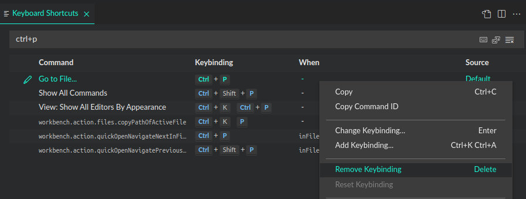

<h1 align="center">
  <br>
    
  <br>
	<br>
  File Bunny
  <br>
  <br>
</h1>
<h4 align="center">Perform file actions quickly with keyboard-driven file selection. 🐰⌨️</h4>

<p align="center">


<a href="https://ko-fi.com/roboleary"></a>
</p>

No need to *hop* to the Sidebar to work with files. 😜

## Consolidated lists for quick file selection

For some file actions, we can consolidate the list of files into a single list for quick selection.

Take the command, `File Bunny: Move Active File`. A QuickPick dialog lets you choose a destination from all folders (and subfolders) in your workspace.


The list is narrowed down to matched selections as you type, the same as the Command Palette.

You can exclude folders from the list with the `excludes` settings option to keep the list concise.

## Incremental completion to find files quickly

Incremental completion builds a filepath quickly. This is achieved through a QuickPick dialog populated with a file list, and tabbed autocompletion to append each segment.

Take the command, `File Bunny: Open a Folder`.


In this example, I do the following to open my *Beer Advisor* project:

1. Type "and", which highlights  the *Android* folder as the first option. Press <kbd>Tab</kbd> to select it.
2. Type "beer", which highlights the *beer-advisor* folder as the first option. Press <kbd>Tab</kbd> to select it.
3. Accept the current directory (first option) by pressing <kbd>Enter</kbd> to open it.

This process of building paths is quick and mitigates errors drastically. You cannot create an incorrect path.

You can also walk the file system with the arrow keys. Use the left arrow to go back, and right arrow to go forward through the file system if you need to search.

## Actions on the active file

Quite often, you want to do something to a file you're already working on. Why re-find the file in the sidebar to perform an action?


For example, the command  `File Bunny: Delete Active File` will immediately delete the active file (it ends up in the trash).

After the file is deleted, focus is switched to the next open file. This way you can carry on editing without needing to switch view to return to an active state. Other extensions don't do this!

## Destructive actions are safe

If you delete a file, it is sent to the trash (recycle bin).

If you create, move, or duplicate a file, overwriting another file or folder is not possible.

## Commands

The following commands can be run from the Command Palette (`Ctrl+Shift+P`):

1. `File Bunny: Create New File`: Create a new file in the current workspace.
1. `File Bunny: Move Active File`: Move the active file to another location in the current workspace.
1. `File Bunny: Duplicate Active File`: Copy the active file and place it somewhere in the current workspace.
1. `File Bunny: Rename Active File`
1. `File Bunny: Delete Active File`: Delete the active file. The file is put into the trash (recycle bin).
1. `File Bunny: Open Folder`: Choose a folder to open as the workspace.
1. `File Bunny: Open Workspace Folder Externally`: Open the current workspace folder in the Operating Systems' file explorer.
1. `File Bunny: Go to Top of Active File`: The `Home` key is bound to this command also.
1. `File Bunny: Go to End of Active File`: The `End` key is bound to this command also.
1. `File Bunny: Copy File Name`: Copy the file name of the active file to the clipboard.
1. `File Bunny: Copy Relative Path`: Copy the relative file path of the active file to the clipboard.
1. `File Bunny: Copy Absolute Path`: Copy the absolute file path of the active file to the clipboard.

You can purchase the <strong><a href="https://ko-fi.com/s/17e88aa21f">premium version</a></strong> from my store. It is also available to my supporters. It has the following additional commands:

1. `File Bunny: Open File`: Choose a file to open from the current workspace.
1. `File Bunny: Open File to the Right`: Choose a file to open from the current workspace, and split it to the right of the active editor.
1. `File Bunny: Open File to the Left`: Choose a file to open from the current workspace, and split it to the left of the active editor.
1. `File Bunny: Open File Above`: Choose a file to open from the current workspace, and split it above the active editor.
1. `File Bunny: Open File Below`: Choose a file to open from the current workspace, and split it below the active editor.
1. `File Bunny: Open File in External App`: Choose a file to open from the current workspace in the default app.
1. `File Bunny: Open Folder Externally`: Open a folder from the current workspace in the Operating Systems' file explorer.
1. `File Bunny: Create New Folder`: Create a new folder in the current workspace.
1. `File Bunny: Duplicate Folder`: Duplicate a folder from the current workspace, and place it somewhere in the current workspace.
1. `File Bunny: Delete Folder`: Delete a folder from the current workspace.

## Settings

- `Filebunny: Excludes`: Configure glob patterns for excluding files and folders from file lists for commands. By default, the *.git* and *node_modules* folders are ignored in your workspace.

## Keybindings

For multi-step commands such as `File Bunny: Create New File`, there are keybindings for the *next* and *previous* commands that enable you to go back and forth between steps. These keybindings are only active when you run a multi-step command.

| Keybinding  | Command Name   | Description | When Clause |
|-------------- | -------------- |-------------- |-------------- |
| Right arrow key <br/> (or <kbd>Tab</kbd> for `File Bunny: Open Folder`)  | `filebunny.next`    | Skip to next step of a multi-step command | `inFileBunny` |
| Left arrow key | `filebunny.back` | Go back to previous step of a multi-step command | `inFileBunny` |
| <kbd>Home</kbd> | `filebunny.goToTopActiveFile` | Go to the first line of the active file | `!editorReadonly && editorFocus` |
| <kbd>End</kbd> | `filebunny.goToBottomActiveFile` | Go to the last line of the active file | `!editorReadonly && editorFocus` |

If you want to change this keybindings, you can read the section [Custom keybindings](#custom-keybindings).

## Activation

The extension is loaded once VS Code has fully loaded. To be more specific, it is triggered by the `onStartupFinished` [activation event](https://code.visualstudio.com/api/references/activation-events).

## Installation

1. The extension is listed in the [VS Code Marketplace](https://marketplace.visualstudio.com/items?itemName=robole.file-bunny) and [Open VSX Marketplace](https://open-vsx.org/extension/robole/file-bunny) where you can download or install it directly.
1. Inside VS Code: Type `Ctrl+P`, write `ext install robole.file-bunny` in the text field, and hit `Enter`.
1. From the Command-line: Run the command `code --install-extension robole.file-bunny`.

## Custom keybindings

You may want to edit one of File Bunnys' predefined keybindings or add a keybinding for one of File Bunnys' commands. You can read the [Key Bindings for Visual Studio Code guide](https://code.visualstudio.com/docs/getstarted/keybindings) to learn more about keybindings, but I will give you an abbreviated version related to this extension.

To edit your keybindings, you can open the `keybindings.json` file with the command `Preferences: Open Keyboard Shortcuts (JSON)`. If there is a keybinding already defined for a key combination you want to use, you may need to disable it if they target the same context. You can check the existing keybindings by opening *Keyboard Shortcuts* with the command `Preferences: Open Keyboard Shortcuts`.

To change a predefined keybinding to an unallocated key combination, just add a new keybinding. For example, say you want to change `filebunny.back` to <kbd>Ctrl</kbd> + <kbd>Shift</kbd> + <kbd>Backspace</kbd>. You can add the following to `keybindings.json`:

```json
  {
    "key": "Ctrl+Shift+Backspace",
    "command": "filebunny.back",
    "when": "inFileBunny"
  }
```

We include the [when clause](https://code.visualstudio.com/api/references/when-clause-contexts) of `inFileBunny` to ensure that this keybinding only applies to multi-step commands in File Bunny.

I like to add a keybinding for `File Bunny: Open File` command. I prefer to use it instead of the default `Go to File...` command that is triggered by <kbd>Ctrl</kbd> + <kbd>P</kbd>. Since this key combination is allocated already, we must disable it. You can do this by adding the following to your `keybindings.json`:

```json
 {
    "key": "ctrl+p",
    "command": "-workbench.action.quickOpen"
 },
 {
    "key": "ctrl+p",
    "command": "filebunny.openFile"
 }
```

The first keybinding entry disables the existing keybinding, you notice that the command is prepended with a hyphen to denote this. You can disable keybindings yourself in *Keyboard Shortcuts* by right-clicking on the keybinding and selecting "Remove keybinding", as per screenshot below. That adds the entry to `keybindings.json` for you.



If you would like to add a keybinding for any other command, you can use the following names in the `command` property:

| Title  | Name   |
|-------------- | -------------- |
| `File Bunny: Create New File`   | `filebunny.createFile`    |
| `File Bunny: Move Active File` | `filebunny.moveFile` |
| `File Bunny: Duplicate Active File` | `filebunny.duplicateFile` |
| `File Bunny: Rename Active File` | `filebunny.renameFile` |
| `File Bunny: Delete Active File`| `filebunny.deleteFile` |
| `File Bunny: Open Folder` | `filebunny.openFolder` |
| `File Bunny: Open Workspace Folder Externally` | `filebunny.openWorkspaceFolderExternal` |
| `File Bunny: Go to Top of Active File` | `filebunny.goToTopActiveFile` |
| `File Bunny: Go to End of Active File` | `filebunny.goToBottomActiveFile` |
| `File Bunny: Copy File Name` | `filebunny.copyFileName` |
| `File Bunny: Copy Relative Path` | `filebunny.copyRelativeFilePath` |
| `File Bunny: Copy Absolute Path` | `filebunny.copyAbsoluteFilePath` |
| `File Bunny: Open File in External App` | `filebunny.openFile`
| `File Bunny: Open File` | `filebunny.openFile` |
| `File Bunny: Open File to the Right` | `filebunny.openFileToRight` |
| `File Bunny: Open File to the Left` | `filebunny.openFileToleft` |
| `File Bunny: Open File Above` | `filebunny.openFileAbove` |
| `File Bunny: Open File Below` | `filebunny.openFileBelow` |
| `File Bunny: Open Folder Externally` | `filebunny.openFolderExternal` |
| `File Bunny: Create New Folder` | `filebunny.createFolder` |
| `File Bunny: Duplicate Folder` | `filebunny.duplicateFolder` |
| `File Bunny: Delete Folder` | `filebunny.deleteFolder`  |

## Frequently Asked Questions (FAQ)

### 1) Does File Bunny support multi-root workspaces?

No. I don't use multi-root workspaces, so I have not implemented this feature. If you are interested in this feature, feel free to open an issue and mark it as an "enhancement". If there is enough interest, I will consider implementing it. The current behaviour for a multi-root workspace is that you will only be able to perform actions on the first folder of the workspace.

### 2) Why can't I delete an image with the command `File Bunny: Delete Active File` ?

This is a current limitation of VS Code. When you open an image in VS Code, the tab cannot be referenced through the Extensions API. There is an [open issue](https://github.com/microsoft/vscode/issues/15178) to change this. When [if] this change happens, I can update the extension to incorporate this behaviour.

## Contribute

If you have a suggestion or find a bug, please file an issue.

## Show gratitude

If you are happy with the extension, please star the repo, and leave a review to help others find it. 🌟

You can [buy me a coffee](https://ko-fi.com/roboleary) if you would like to support me in my quest to make more great open-source software. ☕🙏
